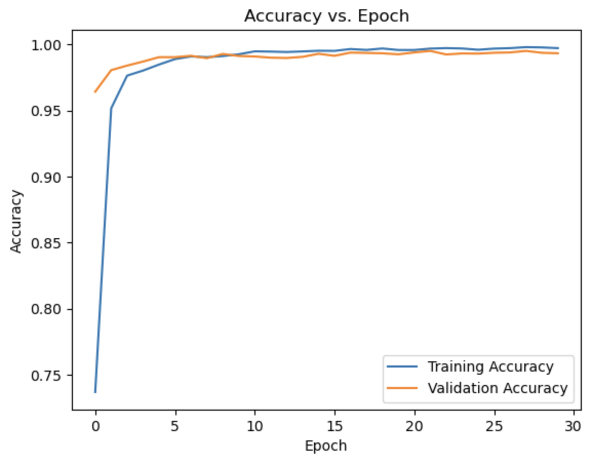
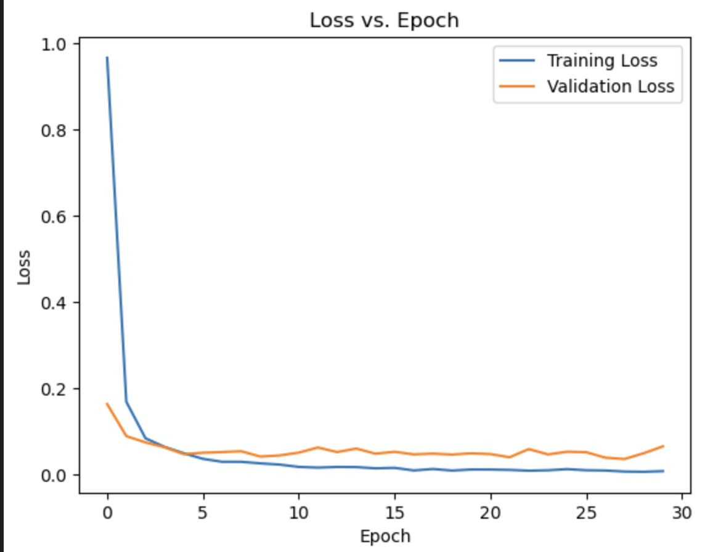
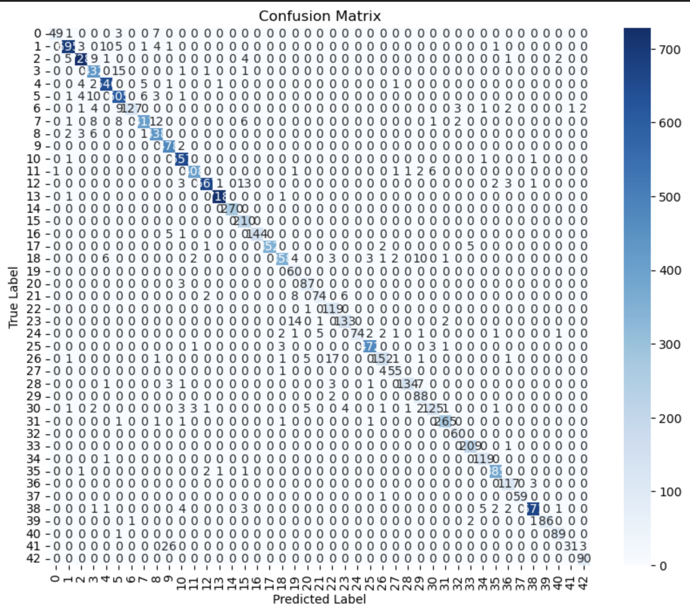

# CNN for Traffic Sign Classification


This project is a foundational exploration into computer vision, focusing on building, training, and evaluating a Convolutional Neural Network (CNN) to classify traffic signs. The model is trained on the German Traffic Sign Recognition Benchmark (GTSRB) dataset and is capable of identifying 43 different types of traffic signs.

## Project Overview

The goal of this project is to develop a deep learning model that can accurately classify traffic sign images. This is a crucial task for autonomous driving systems and driver assistance technologies. This implementation demonstrates an end-to-end machine learning workflow, from data preprocessing to model evaluation and inference on new images.

### Dataset

The model is trained on the **German Traffic Sign Recognition Benchmark (GTSRB)**.
- **Classes:** 43 different traffic sign categories.
- **Images:** Over 50,000 images in total, split into training and testing sets.
- **Image Size:** All images were preprocessed and resized to 32x32 pixels.

## Key Features

- **CNN Architecture:** A custom CNN built from scratch using TensorFlow and Keras.
- **Data Preprocessing:** Includes image resizing, normalization, and a stratified train-validation split to handle class imbalance.
- **Comprehensive Evaluation:** The model's performance is analyzed using accuracy metrics, loss plots, a confusion matrix, and a detailed classification report.
- **Inference Script:** A clear example of how to use the trained model to predict the class of a new, unseen traffic sign image.

## Results

The model achieved a **Test Accuracy of 96.18%** on the GTSRB test set, demonstrating a strong ability to generalize to unseen data.

### Training & Validation Performance

**Accuracy vs. Epoch**


**Loss vs. Epoch**


### Confusion Matrix

The confusion matrix below shows the model's performance on the test set for each of the 43 classes. The diagonal indicates the number of correct predictions per class.



## Methodology

#### 1. Data Preprocessing
- Images were loaded from the dataset directories.
- Each image was resized to 32x32 pixels.
- Pixel values were normalized to a range of [0, 1] by dividing by 255.
- The dataset was split into training (80%) and validation (20%) sets.

#### 2. Model Architecture
A sequential CNN was constructed with the following layers:

```
_________________________________________________________________
 Layer (type)                Output Shape              Param #   
=================================================================
 conv2d (Conv2D)             (None, 32, 32, 64)        1792      
                                                                 
 conv2d_1 (Conv2D)           (None, 32, 32, 128)       73856     
                                                                 
 max_pooling2d (MaxPooling2D) (None, 16, 16, 128)      0         
                                                                 
 dropout (Dropout)           (None, 16, 16, 128)       0         
                                                                 
 flatten (Flatten)           (None, 32768)             0         
                                                                 
 dense (Dense)               (None, 128)               4194432   
                                                                 
 dropout_1 (Dropout)         (None, 128)               0         
                                                                 
 dense_1 (Dense)             (None, 43)                5547      
                                                                 
=================================================================
Total params: 4,275,627
Trainable params: 4,275,627
Non-trainable params: 0
_________________________________________________________________
```

#### 3. Training
- **Optimizer:** Adam
- **Loss Function:** Sparse Categorical Crossentropy
- **Epochs:** 30
- **Batch Size:** 64

## Tech Stack

- Python 3.12
- TensorFlow & Keras
- Scikit-learn
- NumPy & Pandas
- Matplotlib & Seaborn
- Pillow (PIL)

## Local Setup & Usage

To run this project on your local machine, follow these steps:

1.  **Clone the repository:**
    ```bash
    git clone [https://github.com/your-username/traffic-sign-classification.git](https://github.com/your-username/traffic-sign-classification.git)
    cd traffic-sign-classification
    ```

2.  **Create and activate a virtual environment (recommended):**
    ```bash
    python -m venv venv
    source venv/bin/activate  # On Windows, use `venv\Scripts\activate`
    ```

3.  **Install the required dependencies:**
    *(Create a `requirements.txt` file with the content below and place it in your project's root directory.)*
    ```bash
    pip install -r requirements.txt
    ```

4.  **Download the Dataset:**
    - Download the GTSRB dataset from [here](https://benchmark.ini.rub.de/gtsrb_dataset.html).
    - Extract the contents and place the `Train` and `Test` folders inside a `Data/` directory in the project's root. The final `Test.csv` file should also be in `Data/`.

5.  **Run the Jupyter Notebook:**
    - Launch Jupyter and open the `Traffic Sign Classification Using CNN.ipynb` notebook to see the full analysis, training, and evaluation process.
    ```bash
    jupyter notebook
    ```

### `requirements.txt`
```
tensorflow
scikit-learn
numpy
pandas
matplotlib
seaborn
Pillow
```

## Future Improvements

This project serves as a strong baseline. Potential future enhancements include:
- **Data Augmentation:** Implement image augmentation (rotation, zoom, flips) to improve model robustness and handle variations in real-world images.
- **Refactor to Scripts:** Convert the notebook into a structured project with separate Python scripts for training, evaluation, and prediction.
- **Web Interface:** Build a simple web application using Streamlit or Gradio to allow users to upload their own traffic sign images for classification.
- **Transfer Learning:** Experiment with pre-trained models like MobileNetV2 or VGG16 to compare performance with the custom-built CNN.
